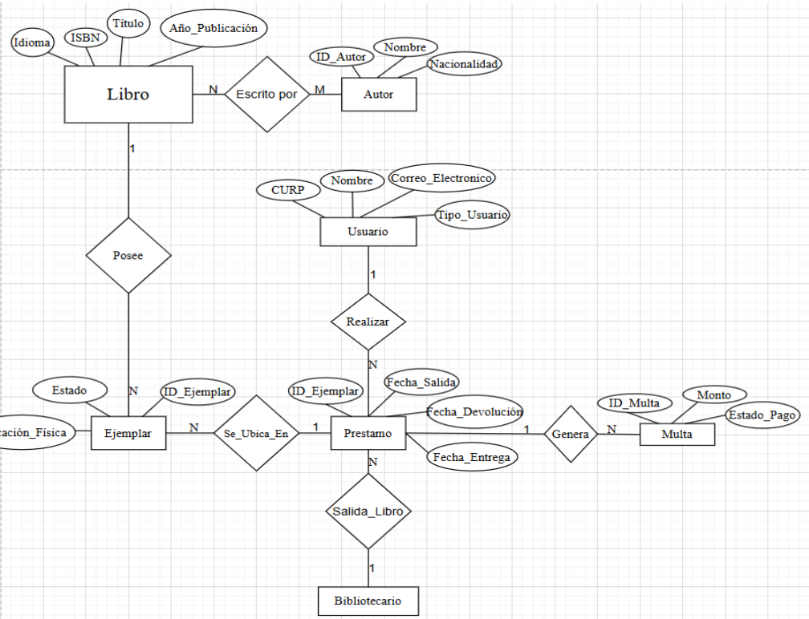
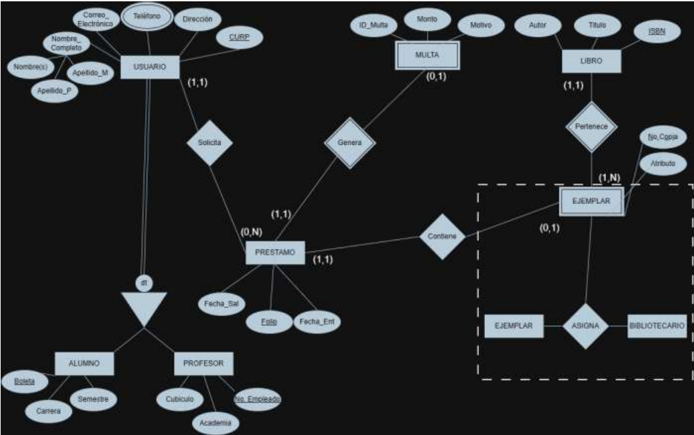
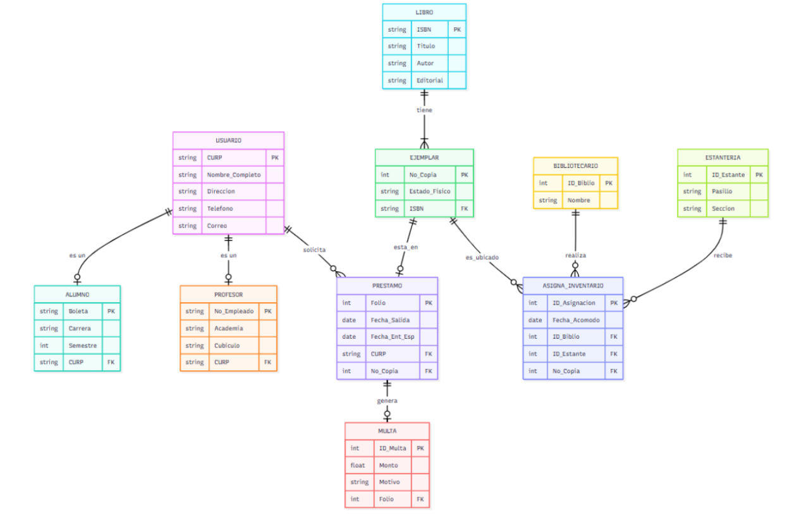
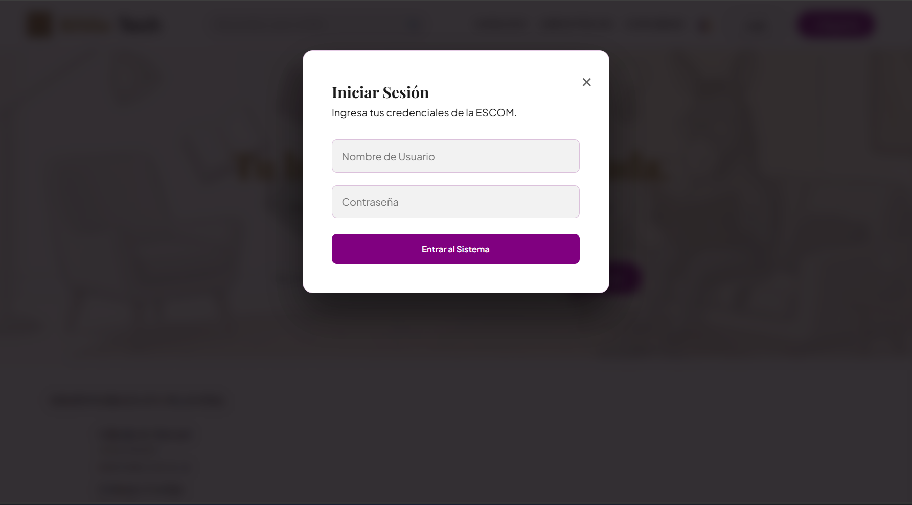
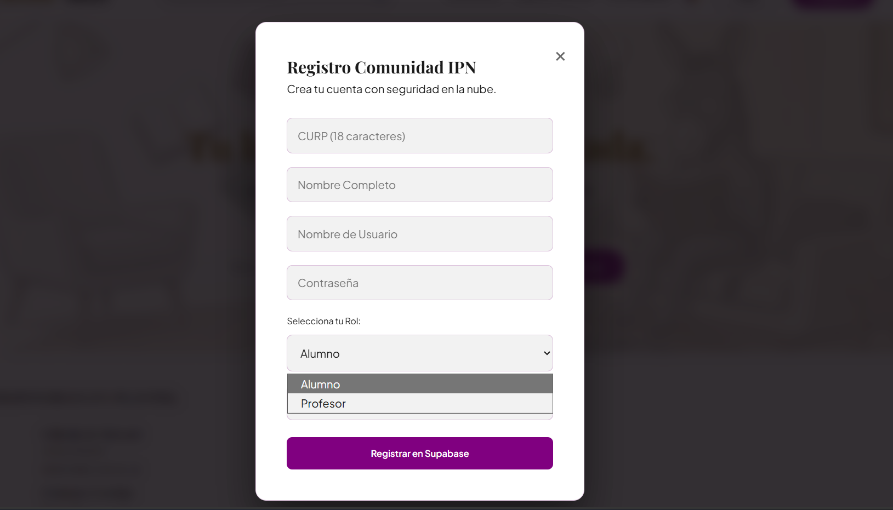
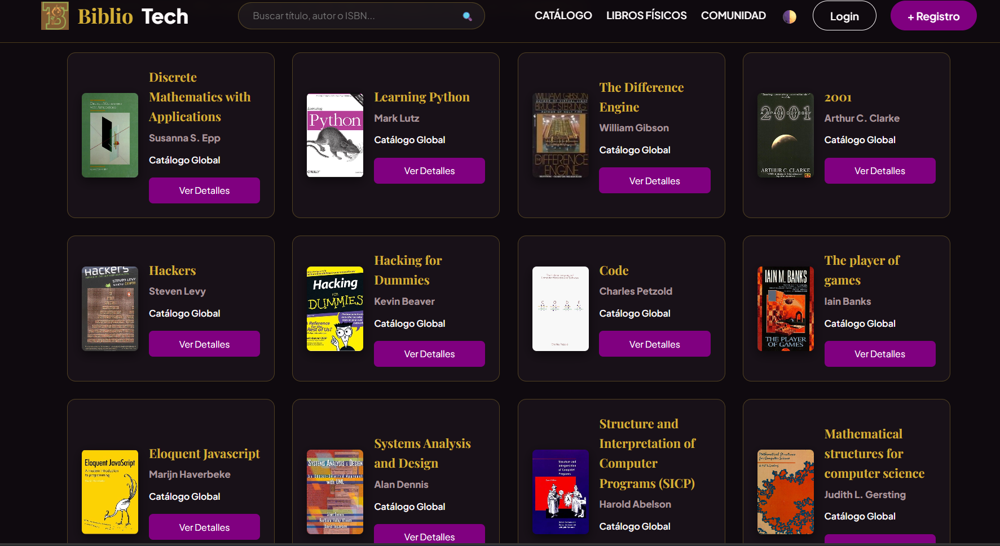

# xsuik33.github.io

# BiblioTech - Gestión de Biblioteca ESCOM

Plataforma web enfocada en la comunidad universitaria (alumnos y profesores) del Instituto Politécnico Nacional, diseñada para modernizar y facilitar la administración del catálogo de libros. El sistema permite a los usuarios explorar millones de ejemplares en la red global mediante una API externa y gestionar solicitudes de préstamos físicos del acervo local.

**Asignatura:** Bases de Datos
**Grupo:** 3CV2
**Profesor:** Gabriel Hurtado Avilés

## Equipo de Desarrollo
* González Ortiz Iker Saúl
* Juárez Bobadilla Miguel Isaí

---

## Enlaces del Proyecto
* **Código Fuente:** [Repositorio en GitHub](https://github.com/xsuik33/xsuik33.github.io)
* **Demo en Vivo:** [BiblioTech Web](https://xsuik33.github.io)

---

## Tecnologías Implementadas

* **Base de Datos / Backend:** PostgreSQL alojado en Supabase.
* **Autenticación:** Supabase Auth (Integración segura de sesiones).
* **Consumo de Datos Externos:** Open Library API REST.
* **Frontend:** HTML5, CSS3 avanzado (Flexbox/Grid, variables CSS) y JavaScript vanilla (Fetch API, manipulación dinámica del DOM).
* **Despliegue:** GitHub Pages.

---

## Evolución y Metodología del Proyecto

El desarrollo de BiblioTech se llevó a cabo siguiendo una metodología de ingeniería de software estructurada, partiendo desde el contacto con el cliente hasta la implementación de la interfaz final.

### Origen: Levantamiento de Requerimientos y Entrevista
Todo proyecto sólido nace de una necesidad del mundo real. Para este sistema, el proceso comenzó con una **entrevista directa con el cliente** (la administración de la biblioteca). Durante este levantamiento de requerimientos, se documentó que la biblioteca operaba bajo un modelo analógico que generaba múltiples conflictos operativos:
* **Falta de trazabilidad:** El control de inventario se llevaba en registros manuales vulnerables a errores, dificultando saber la ubicación exacta de un libro físico.
* **Identificación obsoleta:** Se utilizaban carnets físicos de cartón que los usuarios perdían frecuentemente, borrando su historial de préstamos.
* **Arbitrariedad en sanciones:** El cálculo de fechas de entrega y multas por retraso dependía del criterio manual del bibliotecario, provocando fricciones con los alumnos y pérdidas en la recuperación de material.

A partir de este análisis, se definió la **Problemática Principal**: *Migrar urgentemente el control operativo hacia un sistema de información digital y relacional que elimine el error humano, automatice las reglas de negocio y garantice la certeza absoluta sobre la posesión del acervo.*

### Fase 1: Análisis y Modelo Entidad-Relación (ER)
Con el problema definido, se procedió a abstraer la realidad mediante la definición de entidades clave (`Usuario`, `Libro`, `Ejemplar`, `Préstamo`, `Multa`, `Bibliotecario`, `Autor`, `Editorial`, `Estantería`) para resolver los puntos críticos:
1. **Certeza sobre la posesión y tiempos:** Al relacionar `Ejemplar`, `Préstamo` y `Usuario`, el sistema permite generar consultas instantáneas para saber exactamente qué usuario tiene qué código de barras y mostrar su fecha límite.
2. **Registro digital:** Al digitalizar la entidad `Usuario` utilizando la CURP, la biblioteca ya no depende de carnets físicos.
3. **Cálculo automático de multas:** Se establecieron los atributos `Fecha_Devolución_E` (Esperada) y `Fecha_Entrega_R` (Real) en el `Préstamo`. Al relacionarlo con `Multa`, el sistema ejecuta una lógica que resta ambas fechas y multiplica por la tarifa diaria.

  
   
  <em>Figura 1: Diagrama ER inicial con la identificación de entidades y atributos base tras la entrevista.</em>

### Fase 2: Modelo Entidad-Relación Extendido (EER)
El modelo básico resultaba insuficiente para las reglas de negocio del cliente. Se implementó el Modelo EER para solucionar ambigüedades críticas, utilizando la Notación de Peter Chen para comprender a profundidad la semántica.

  
   
  <em>Figura 2: Diagrama EER en notación Peter Chen resaltando las jerarquías y entidades débiles.</em>

#### Conceptos Avanzados Aplicados
* **Entidades Débiles (Dependencia de Existencia):** * `EJEMPLAR`: Se distinguió la obra intelectual abstracta (`Libro`) del objeto tangible físico (`Ejemplar`). Su identificador (`No_Copia`) es un discriminante parcial que solo cobra sentido al combinarse con el `ISBN` del libro.
  * `MULTA`: Se clasifica como débil transaccional; depende lógicamente de un registro de `Préstamo` previo que justifique la sanción.
* **Jerarquía de Especialización (Herencia ISA):**
  * Se implementó una jerarquía **Total y Disjunta** para separar los privilegios de préstamo entre alumnos y profesores sin generar valores nulos en las tablas.
* **Relaciones de Orden Superior (Agregación):** La relación ternaria `ASIGNA` vincula al `Bibliotecario`, el `Ejemplar` y la `Estantería` para rastrear auditorías de inventario.

### Fase 3 y 4: Transformación Relacional e Implementación DDL/DCL
El modelo EER se tradujo a esquemas relacionales exactos y se construyó en PostgreSQL (Supabase). Para esta fase, la notación evolucionó al **Modelo Relacional (Notación Crow's Foot)**, definiendo explícitamente las Llaves Primarias (PK) y Foráneas (FK).

  
   
  <em>Figura 3: Modelo Relacional (Crow's Foot) consolidado tras aplicar las reglas de transformación.</em>

#### Transformación y Restricciones Físicas
1. **Resolución de Relaciones N:M:** La autoría múltiple se resolvió creando la tabla asociativa `ESCRITO_POR` (rompiendo la relación muchos a muchos entre `Libro` y `Autor`).
2. **Resolución de Herencia:** Los subtipos `ALUMNO` y `PROFESOR` se crearon como tablas independientes apuntando al supertipo `USUARIO` mediante la `CURP`.
3. **Integridad Referencial (Borrado en Cascada):** Las entidades débiles se implementaron con la acción `ON DELETE CASCADE`. Si un libro es retirado, sus copias físicas se eliminan automáticamente del inventario.
4. **Restricciones de Dominio (Constraints):**
   * `CHECK`: Se validó que la fecha de devolución no sea menor a la de salida, que los correos contengan un `@`, y que el estado de los ejemplares se limite a: `Excelente`, `Desgastado` o `Dañado`.
   * `UNIQUE`: Aplicado a correos y números de boleta para evitar cuentas duplicadas.
   * `DEFAULT`: Asignación de valores por defecto para agilizar transacciones.
5. **Seguridad (DCL):** Configuración de roles de administrador y cliente en Supabase.

### Fase 5: Desarrollo de la Interfaz Web
La robusta base de datos se consumió mediante peticiones asíncronas para dar vida a la plataforma web con la que interactúan los estudiantes y bibliotecarios.

**Funcionalidades Destacadas:**
* Registro e inicio de sesión seguro validado para la comunidad universitaria.
* Interfaz con soporte nativo para **Modo Claro / Modo Oscuro**.
* Paginación dinámica y renderizado de tarjetas de catálogo sin recargar la página.
* Sistema de internacionalización (i18n) en tiempo real (Español, Inglés y Francés).
* Sistema interactivo de préstamos.

---

## Galería del Sistema

🖼️ Ver capturas de pantalla de la plataforma

| Pantalla de Inicio | Inicio de Sesión |
|:---:|:---:|
|  |  |

| Registro de Usuario | Vista de Catálogo / Sección |
|:---:|:---:|
|  |  |

| Vista Previa del Libro |
|:---:|
|  |

